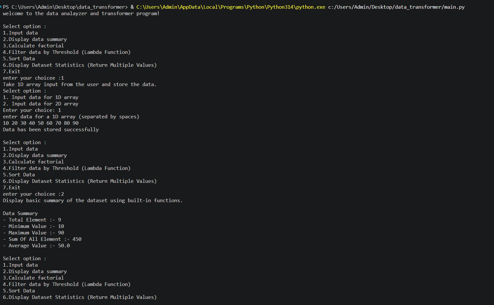

# Data Analyzer and Transformer

## Subtitle of the Project

A simple Python program that analyzes, filters, sorts, and calculates statistics from user-provided data.

## About the Project

This project is a beginner-friendly Python program that provides an interactive menu to analyze and transform data.

The program allows the user to select from the following options:
* Input data for a 1D array.
* Input data for a 2D array.
* Display the summary of the dataset.
* Calculate the factorial of a number.
* Filter data using a threshold value.
* Sort data in ascending or descending order.
* Display dataset statistics.
* Exit the program.

The program stores the entered data and performs different operations based on the user's choice.
The program continues displaying the menu until the user chooses the Exit option.

## Output



## Features

* Displays an interactive menu.
* Allows the user to input data for a 1D array.
* Allows the user to input data for a 2D array.
* Uses docstrings (__doc__) to provide documentation for functions.
* Displays the total number of elements.
* Displays the minimum and maximum values.
* Calculates the sum and average of the dataset.
* Calculates the factorial of a number using recursion.
* Filters data based on a threshold value.
* Uses a lambda function for filtering data.
* Sorts data in ascending order.
* Sorts data in descending order.
* Uses *args to accept a variable number of arguments.
* Displays dataset statistics.
* Uses multiple return values.
* Uses conditional statements for different operations.
* Allows the user to exit the program.

## Concepts Used

* Variables and data types.
* Lists.
* User input.
* Type conversion.
* If, elif, and else statements.
* For and while loops.
* Functions.
* Function documentation using docstrings (__doc__).
* Recursion.
* Lambda functions.
* Filter function.
* Map function.
* Sorting.
* Variable-length arguments using *args.
* Built-in functions.
* Multiple return values.
* Global variables.
* Menu-driven programming.

## Built-in Functions Used

* `len()`
* `min()`
* `max()`
* `sum()`
* `round()`
* `sorted()`
* `list()`
* `map()`
* `filter()`

## Technology Used

* Python
* Visual Studio Code (VS Code)
* Git
* GitHub

## How to Run

### Step 1: Install Python

```bash

https://www.python.org/downloads/
```

### Step 2: Run the Program

```bash
python main.py
```

## Project Structure
```text
│
├── main.py
├── output.png
└── README.md
```
## Learning Objectives

By completing this project, you can learn:

* How to take input from the user in Python.
* How to use variables and data types.
* How to create and use lists.
* How to use if, elif, and else statements.
* How to use for and while loops.
* How to create and call functions.
* How to use built-in Python functions.
* How to calculate basic statistics from data.
* How to use docstrings and access them using __doc__.
* How to use lambda functions.
* How to use the filter() function.
* How to sort data using the sorted() function.
* How to implement recursion in Python.
* How to use *args to pass a variable number of arguments to a function.
* How to return multiple values from a function.
* How to create a menu-driven Python program.
* How to perform basic data analysis and transformation.
* How to control program flow based on user choices.

## Author

Anjali Mehta